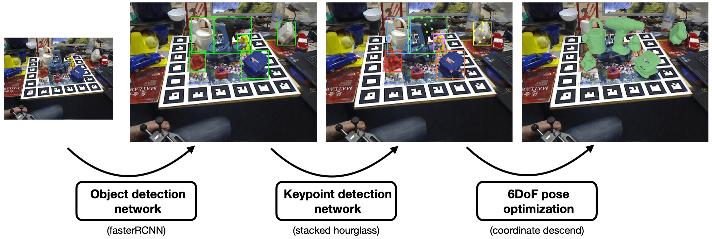

# 6D_Pose
Python implementation for the BOP benchmark section of the paper: \
**Semantic keypoint-based pose estimation from single RGB frames**  
Field Robotics \
[[Paper](https://arxiv.org/abs/2204.05864)]


## Data
You can download our pretrained models for [detection](https://drive.google.com/drive/folders/1Jzg-9sU4nEGawTREsMFblmBEZouPMOjM?usp=sharing) and [keypoint detection](https://drive.google.com/drive/folders/1i9Y5lFm3jc2t8qtxoB-qQJEDLc0urZao?usp=sharing). Please place the models as follows. We also put the test images for the LMO dataset in this repo for convenience.
```
- data
-- detect_checkpoints
-- kpts_checkpoints
```

## Demo
Our method uses additional 3D keypoint annotation on the CAD models, which is included in **kpts_3d.json**. We provide two demo. To explore the 3D annotation, please use **demo_data.ipynb**. To explore the inference pipeline, please use **demo_pipeline.ipynb**. 

@article{schmeckpeper2022semantic,
  title={Semantic keypoint-based pose estimation from single RGB frames},
  author={Schmeckpeper, Karl and Osteen, Philip R and Wang, Yufu and Pavlakos, Georgios and Chaney, Kenneth and Jordan, Wyatt and Zhou, Xiaowei and Derpanis, Konstantinos G and Daniilidis, Kostas},
  journal={arXiv preprint arXiv:2204.05864},
  year={2022}
}
